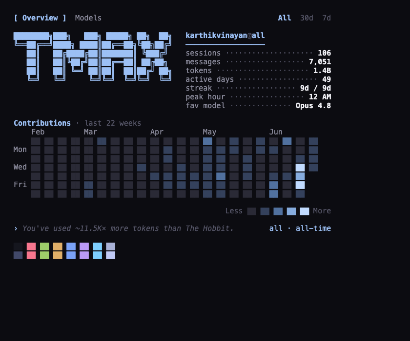
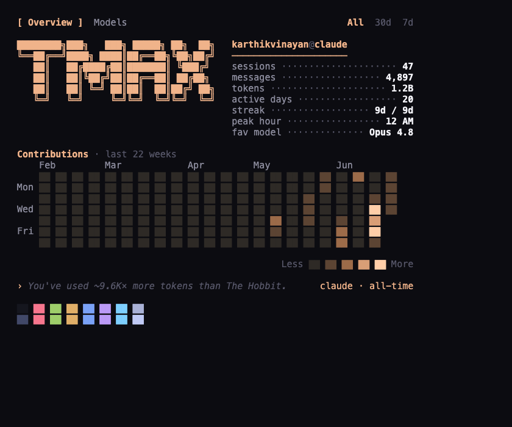
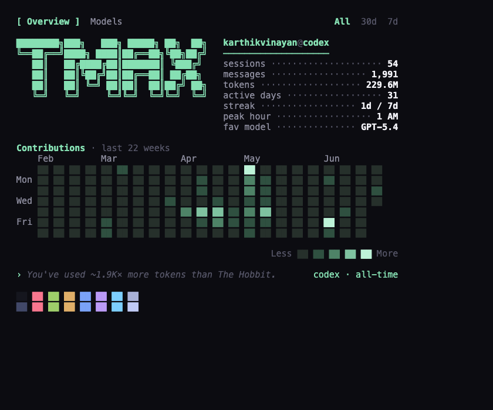
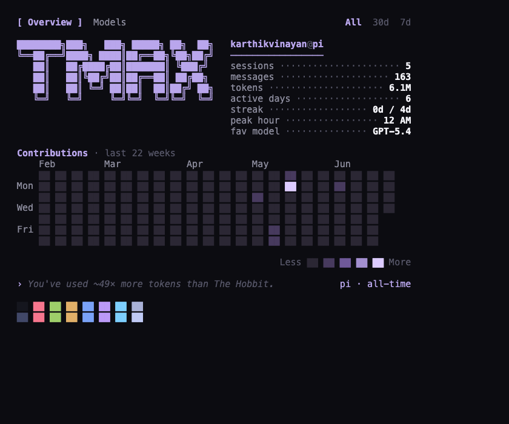
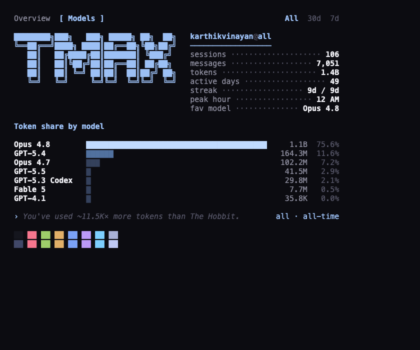
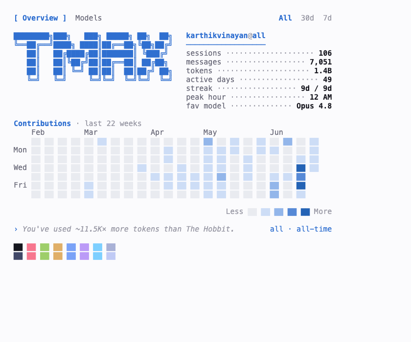

<h1 align="center">tmax</h1>

<p align="center">
  <em>A pastel, neofetch-style terminal card for your AI coding-harness token usage.</em>
</p>

<p align="center">
  <a href="https://github.com/o1x3/tmax/actions/workflows/ci.yml"></a>
  <a href="https://github.com/o1x3/tmax/releases/latest"></a>
  <a href="LICENSE"></a>
  
</p>

<p align="center">
  
</p>

A blocky `tmax` wordmark and a `you@harness` info column up top, a GitHub-style
contribution graph as the hero, and a colour-swatch palette along the bottom.
One glance shows your sessions, messages, tokens, streaks and activity — across
**Claude Code**, **Codex** and **pi.dev**, together or one at a time.

Like neofetch/fastfetch, tmax paints **no background and draws no border** — it
sits directly on your terminal's own background, detects whether you're in a
light or dark theme, and adapts its colours so it always blends in. Everything
reads from your local session logs; nothing leaves your machine.

## Install

```sh
curl -fsSL https://raw.githubusercontent.com/o1x3/tmax/main/install.sh | sh
```

The script grabs the right prebuilt binary for your OS/arch (macOS & Linux,
amd64 & arm64), verifies its checksum, and drops it on your `PATH`.

<details>
<summary>Other ways</summary>

```sh
# with Go
go install github.com/o1x3/tmax@latest

# a specific version, or a custom install dir
TMAX_VERSION=v0.1.0 TMAX_BIN_DIR="$HOME/.local/bin" \
  sh -c "$(curl -fsSL https://raw.githubusercontent.com/o1x3/tmax/main/install.sh)"

# from source
git clone https://github.com/o1x3/tmax && cd tmax && go build -o tmax .
```
</details>

## Usage

```text
tmax [harness] [range] [tab] [-i]

HARNESS   claude | codex | pi | all        (default: all)
RANGE     all | 30d | 7d                   (default: all)
TAB       overview | models               (default: overview)
FLAGS     -i/--tui   interactive
          -h/--help  help
COMMANDS  upgrade    install the latest release
          version    print the installed version
```

Arguments are positional and order-independent — `tmax pi 7d models` and
`tmax models pi 7d` are the same.

```sh
tmax                 # everything, all-time
tmax claude 7d       # Claude Code, last 7 days
tmax codex models    # Codex, token share by model
tmax pi -i           # pi.dev, interactive
```

### Interactive mode

```text
←/→   switch harness          tab   Overview ⇄ Models
1/2/3 All / 30d / 7d          q     quit
```

## Looks

Each harness gets its own accent and matching heatmap ramp, so a glance tells
you which one you're looking at.

| | |
|---|---|
|  |  |
| **Claude Code** — peach | **Codex** — mint |
|  |  |
| **pi.dev** — lavender | **Models** tab |

**Light or dark — automatically.** tmax detects your terminal background and
flips its whole palette to match; the swatch row mirrors your terminal's own 16
ANSI colours, so it inherits your theme rather than imposing one.

<p align="center"></p>

Force it either way with `TMAX_BACKGROUND=light|dark` if auto-detection guesses
wrong. When piped or redirected, colour is stripped and the heatmap falls back
to shade glyphs (`░▒▓█`) so it stays legible as plain text; `TMAX_TRUECOLOR=1`
forces 24-bit colour (useful for capture).

## Staying up to date

On a real terminal `tmax` checks GitHub for a newer release **at most once a
day** and prints a one-line notice if one exists. To update:

```sh
tmax upgrade
```

This downloads the latest release for your platform, verifies its checksum, and
replaces the binary in place. Set `TMAX_NO_UPDATE_CHECK=1` to silence the
launch-time check entirely.

## Where the data comes from

tmax reads each harness's local session logs — nothing is sent anywhere.

| Harness | Location | Tokens from |
|---|---|---|
| Claude Code | `~/.claude/projects/*/*.jsonl` | `message.usage` (input/output/cache) |
| Codex | `~/.codex/sessions/**/rollout-*.jsonl` | `token_count` events (`total_token_usage`) |
| pi.dev | `~/.pi/agent/sessions/*/*.jsonl` | `message.usage` (input/output/cache) |

**Total tokens** counts everything that flowed through the model — fresh input,
output, cache reads and cache writes — so it's dominated by cache reads on long
sessions (that's real work the model did). Claude writes one log line per
content block, all repeating the same cumulative usage; tmax de-duplicates by
message + request id so each turn counts once (matching `ccusage`). Codex
records cumulative totals, so tmax attributes each event's *delta* to its own
day and model. Days, peak hour, streaks and the model breakdown are computed in
your **local** timezone and respect the selected range.

## Development

```sh
go test ./...   # stats, rendering width, the TUI model, and version compare
go vet ./...
go build -o tmax .
```

Built with [lipgloss](https://github.com/charmbracelet/lipgloss) and
[bubbletea](https://github.com/charmbracelet/bubbletea). Releases are cut by
[GoReleaser](https://goreleaser.com) on every `v*` tag.

## License

[MIT](LICENSE) © Karthik Vinayan
